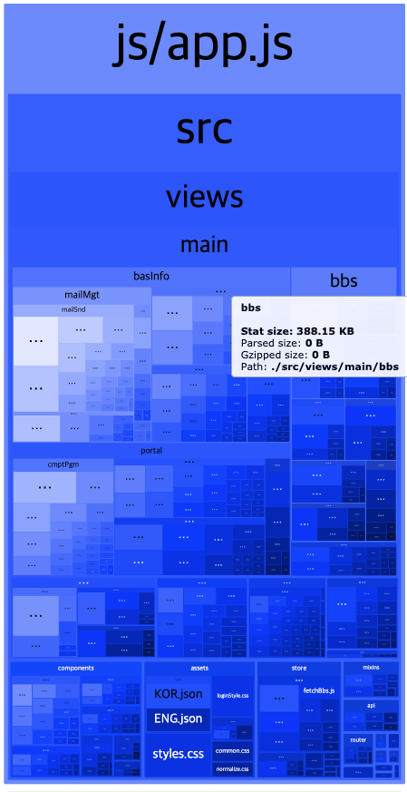
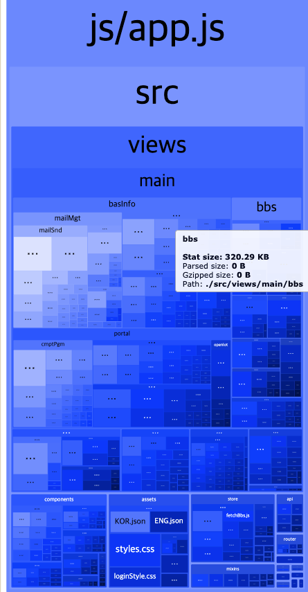

# Vue 재사용성 높이기

## 방법
> 참고 1: https://wormwlrm.github.io/2019/09/08/Higher-Order-Component-pattern-in-Vue.html
> 참고 2: https://joshua1988.github.io/vue-camp/reuse/mixins-vs-hoc.html#hoc-vs-mixins
1. HOC: 컴포넌트를 인수로 받아 컴포넌트를 리턴하는 함수
   - 컴포넌트 관계 사이의 공통 적인 로직을 처리하는 HOC가 추가된다. (계층 관계) 따라서, 각 컴포넌트의 로직에 영향을 미치지 ㅇ낳는다. 
2. mixins: 공통 기능을 분리
    - 여러 컴포넌트에 혼합되어 사용된다. 계층 구조가 없다.
    
### 디자인 패턴 결정
HOC 적용이 괜찮게 생각되었지만... 지금도 계층구조가 너무 심해서 복잡한데, 오히려 관리가 어려워 질 것 같기도하고
mixin에 정의 후 필요시 override 하는 방식이 더 나을 것으로 판단되어 mixin을 적용하기로 결정하였다.

## 이슈
게시판 관리의 코드가 반복 사용되는 경우가 많아서 공통 기능을 분리하고자 한다.
각 컴포넌트의 데이터, form 양식 정도만 바뀔 뿐 거의 다 동일한 로직이 반복되고 있다.
아래와 같은 차이는 존재할 수 있다.
1. 모듈 선택 
2. 파일 첨부 유무

```javascript
computed: {
            ...mapGetters('loader', ['loading']),
            ...mapGetters('comCd', ['langCdList', 'ctgryCtgList']),
            title() {
                return `${this.$i18n.t('menu.faq')} ${this.$i18n.t(this.mode === 'delete' ? 'dtl' : `btn.${this.mode}`)}`;
            },
            boardGrpCd() {
                return this.selectedModule.dtlCd;
            },
        },
        methods: {
            ...mapActions("loader", ["hideLoader"]),
            ...mapActions([
                'regBbs',
                'deleteBbs',
                'updateBbs',
            ]),
            initItem() {
                return {
                    langCd: 'KOR',
                    titleNm: '',
                    sbst: '',
                    ottpYn: 'Y',
                    ctgryCtgCd: null,
                }
            },
            async regFaq() {
                await this.$refs.form.validate();
                if (this.editorDataValidate(this.item.sbst) && this.valid) {
                    this.item.sbst = this.$sanitize(this.item.sbst);

                    await this.regBbs({
                        boardGrpCd: this.boardGrpCd,
                        boardDivCd,
                        body: this.item,
                    }).then(() => {
                        this.showSnackBar(SNACKBAR_TYPE.SUCCESS, this.$i18n.t('message.regSuccess'));
                        this.$emit('refresh');
                        this.closeModal();
                    }).catch(err => {
                        this.showSnackBar(SNACKBAR_TYPE.DANGER, this.$i18n.t('message.failMsg'));
                        console.log(err);
                    });
                }
            },
            messageModalConfirm(type) {
                if (type === 0) {
                    this.deleteFaq();
                } else if (type === 1){
                    this.closeModal();
                }
            },
            async deleteFaq() {
                await this.deleteBbs({
                    boardGrpCd: this.boardGrpCd,
                    boardDivCd,
                    postSeq: this.item.postSeq
                }).then(() => {
                    this.showSnackBar(SNACKBAR_TYPE.SUCCESS, this.$i18n.t('message.delSuccess'));
                    this.$emit('refresh');
                    this.closeModal();
                }).catch(err => {
                    console.log(err);
                });
            },
            async setDtlForm() {
                this.item = await this.faq;
            },
```

```javascript
// 파일을 관리하는 화면
...
computed: {
...mapGetters('comCd', ['langCdList']),
        title() {
        return `${this.$i18n.t('menu.indv-info-policy')} ${this.$i18n.t(this.mode === 'delete' ? 'dtl' : `btn.${this.mode}`)}`;
    },
    boardGrpCd() {
        return this.selectedModule.dtlCd;
    }
},
methods: {
    mapActions([
        'getFileList',
        'regBbs',
        'regFiles',
        'deleteBbs',
        'updateBbs',
        'fileDownload',
    ]),
...
    mapActions("loader", ["hideLoader"]),
        initItem()
    {
        return {
            langCd: 'KOR',
            titleNm: '',
            sbst: '',
            ottpYn: 'Y',
            postExtn: {
                executeDt: '',
            },
            fileCnt: 0,
        };
    },

    async regIndvInfoPolicy() {
        await this.$refs.form.validate();
        if (this.editorDataValidate(this.item.sbst) && this.valid) {
            this.item.sbst = this.$sanitize(this.item.sbst);

            //  첨부파일 변경 시 추가
            if (!(this.file.fileId)) this.files.new.push(this.file);
            await this.regBbs({
                boardGrpCd: this.boardGrpCd,
                boardDivCd,
                body: this.item,
            }).then(res => {
                this.item.postSeq = res.data.postSeq;
                if (this.files.new.length <= 0 && this.files.delete.length <= 0) {
                    this.showSnackBar(SNACKBAR_TYPE.SUCCESS, this.$i18n.t('message.regSuccess'));
                    this.$emit('refresh');
                    this.closeModal();
                } else {
                    this.regIndvInfoPolicyFiles();
                }
            }).catch(err => {
                this.showSnackBar(SNACKBAR_TYPE.DANGER, this.$i18n.t('message.failMsg'));
                console.log(err);
            });
        }
    },
    messageModalConfirm(type) {
        if (type === 0) {
            this.deleteIndvInfoPolicy();
        } else if (type === 1) {
            this.closeModal();
        }
    },
    async deleteIndvInfoPolicy() {
        await this.deleteBbs({
            boardGrpCd: this.boardGrpCd,
            boardDivCd,
            postSeq: this.item.postSeq
        }).then(() => {
            this.showSnackBar(SNACKBAR_TYPE.SUCCESS, this.$i18n.t('message.delSuccess'));
            this.$emit('refresh');
            this.closeModal();
        }).catch(err => {
            console.log(err);
        });
    },
...
}
```

### 고려사항
1. 일단 완전히 똑같은 메소드, 데이터 들은 mixin에 정의하였다.
2. CRUD 통일화?
   -`messageModalConfirm`과 같이 CRUD 메소드를 내부에서 호출하는 메소드들이 종종 있었다.
   - 현재 기능은 유사/동일하나 메소드명만 다른 상태여서 통일화 하기로 결정
   - 파일 첨부에 따라 동일하게 코드 몇 줄이 차이가 남... 
     -> 파일 첨부 유무를 확인하는 변수 놓고 분기처리?
     -> 파라미터로 받아서 분기처리?
3. 모듈, 파일 첨부는 어떻게 통일?
  - mixin 별도로 분리하자니... 양이 적거나 기존 게시판 mixin에서 직접적인 호출이 필요한 부분이 많음
   - 그렇다고 게시판 mixin 내부에 정의하자니, 불필요한데도 data나 methods를 포함하는 경우가 존재

# 결과
388.15KB -> 320.29 KB

## Before


## After
