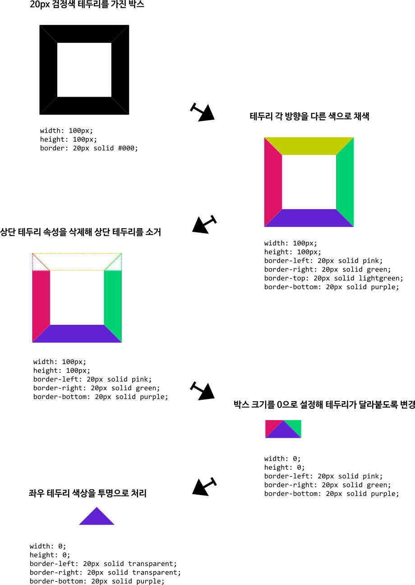

# Component

> 자주 사용되는 컴포넌트 별 css를 정리합니다. 

- https://blog.bitsrc.io/7-tools-for-faster-frontend-development-in-2022-43b6f663c607

## tooltip
테두리를 이용한 화살표 생성
- https://blogpack.tistory.com/867
    
- 사이트도 있음
- Vuetify tooltip 커스터마이징한 css 백업
    ```css
    .v-tooltip__content
    {
      font-size: 6px !important;
      padding: 3px 6px !important;
      background: rgba(97, 97, 97);
      -webkit-border-radius: 3px;
      -moz-border-radius: 3px;
      border-radius: 3px;
      margin-left: 5px;
    }
    
    .v-tooltip__content:after
    {
      position: absolute;
      content: '';
      border-style: solid;
      border-width: 5px 10px 5px 0;
      border-color: transparent rgba(97, 97, 97);
      display: block;
      width: 0;
      z-index: 1;
      left: -10px;
      top: 10px;
    }
    ```