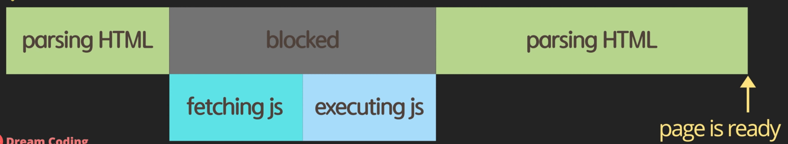
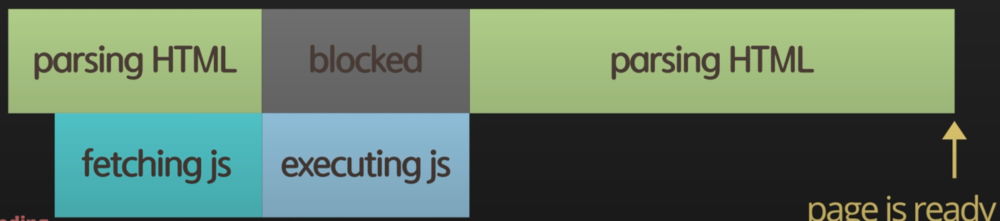
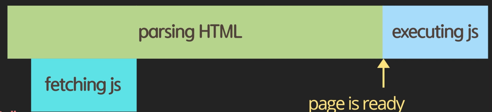

# JavaScript

> 드림코딩 by 엘리 JavaScript 기반 내용 정리

# Script async vs defer

## html에서 js script를 호출하는 보편적인 방법

### 1. head 내에 그냥 선언

```html
<!DOCTYPE html>
<html lang="en">
<head>
    <meta charset="UTF-8">
    <title>Title</title>
    <script src="main.js"></script>
</head>
<body></body>
</html>
```



- `script` 태그가 보이는 즉시 필요한 js 스크립트 파일은 fetch 한 후 실행함
- 단점
    - 파일의 크기가 클 경우 다운 받는 시간이 오래 소요됨
    - 즉, 사용자가 웹 사이트를 보는데 많은 시간이 걸림

### 2. body 끝에 선언
```html
<!DOCTYPE html>
<html lang="en">
<head>
    <meta charset="UTF-8">
    <title>Title</title>
</head>
<body>
<script src="main.js"></script>
</body>
</html>
```

- 내가 써왔던 방법...
- HTML 파싱 후 마지막에 js 다운 받음
- 장점
  - JS 다운 전, 기본적인 HTML 컨텐츠를 미리 확인할 수 있다.
- 단점
  - JS에 의존적인 기능들이 많은 경우 정상적인 페이지 확인이 어려움 (동적 기능, DOM 요소 들이 제대로 실행되지 않음)
  - 즉, JS fetching, excuting 과정을 다 기다려야 함

### Async
```html
<!DOCTYPE html>
<html lang="en">
<head>
    <meta charset="UTF-8">
    <title>Title</title>
    <script async src="main.js"></script>
</head>
<body>
</body>
</html>
```


- `async` 속성 값에 따라 병렬로 js가 fetch가 수행되며, fetch가 완료된 시점에 즉시 실행된다.
- 장점
  - 미리 js 파일을 다운 받고 실행하기 때문에, 다운로드 시간을 절약할 수 있음
- 단점
  - 전체 HTML가 parsing 전에 js가 미리 실행되어 위험하다. 
    - 아직 정의되지 않은 HTML 요소에 대한 DOM 조작 등이 이루어질 수 있기 때문
  - 중간 js 실행을 위해 페이지가 멈출 수 있다.
    - 즉, 사용자가 대기하는 시간이 여전히 오래 걸린다.

### defer
```html
<!DOCTYPE html>
<html lang="en">
<head>
    <meta charset="UTF-8">
    <title>Title</title>
    <script defer src="main.js"></script>
</head>
<body>
</body>
</html>
```


- `defer` 속성 값에 따라 병렬로 js fetch를 수행한다. 단, HTML parsing이 완료된 후에 js가 실행된다.
- 장점
  - 미리 js 파일을 다운 받기 때문에, 다운로드 시간을 절약할 수 있음
  - html parsing을 모두 완료한 후에 js가 즉시 실행되어, async 이슈가 모두 해결된다.
  
## async vs defer 
- 공통점 : 명령이 내려진 즉시 병렬적으로 fetch를 수행한다.
- 차이점
  - async : fetch가 완료된 시점을 기준으로 바로 js가 실행된다.
    - 즉, 명령 순서에 따라 실행 순서가 보장되지 않는다. 
  - defer : 명령 순서에 따라 실행 순서가 보장된다.
    - 다른 모듈을 참고하고 있어 순서 보장이 필요한 경우 유용함.
  
# use strict
- ECMAScript5에 추가된 모드
- Tip
  - VanilaJS 사용시 js 파일 앞 부분에 선언해주면 좋다.
  - TypeScript에서는 필요 없다.
- 사용 목적 : JavaScript가 가지고 있는 Flexible한 특징으로 인해 발생되는 비상식적인 이슈들을 감지하여 에러로 간주해준다.
  - 또한, JS 엔진이 효율적으로 분석할 수 있어 성능 개선까지 기대할 수 있다.
  
#Object
## 1. Literals and property
```javascript
const obj = {}; // object literal
const obj = new Object(); // object contructor
```
- key를 명확하게 알고 있을 때 사용
  
## 2. computed property

```javascript
obj['key'] = true;
```
- Key로 접근 가능
- key를 명확히 모르는 경우(ex- property)

## 3. Property value shorthand
```javascript
function personObj(name, age) {
    return {
        name,
        age
    };
}
```

## 4. Constructor Function
```javascript
const person = new Person('mijeong', 28);
function Person(name, age) {
    // this = {};
    this.name = name;
    this.age = age;
    // return this;
}
```
- Function Constructor  정의 시 자동으로 Object 생성해 

## 5. in operator: property existence check (key in obj)
특정 키가 obj 안에 정의되어 있는지 확인 가능
```javascript
console.log('key' in obj); 
```

## 6. for...in vs for...of
### for (key in obj)
```javascript
for (key in obj) {
    // obj key 순회
}
```

### for (value of iterable)
```javascript
for (value of obj) {
    // obj value 순회
}
```


## 7. cloning
```javascript
const user = { name: 'mijeong', age: 28 };
const user2 = { age: 38 };
const user3 = user; // user와 같은 obj 참조
user.age = 0;
const user4 = {};
Object.assign(user4, user2);
user4.age = 18;

const user5 = {};
Object.assign(user5, user, user2);

console.log(user3.age) // 0
console.log(user4.age) // 18
console.log(user5.age) // 38
```

Object.assign(dest, [obj1, obj2, obj3...])
- 뒤에 정의된 Obj property 값으로 덮어씌워짐
=======

# 데이터타입, data types, let vs var, hoisting

## let vs var

### Var
- block scope이 없음
- Hoisting 때문에 위험함(let은 에러를 띄움)
- 또한, block scope이 없음

### Let
- mutable type
  Constant
- immutable data type
  - Security (해커들이 새로 할당불가)
  - Thread safety : mutable type의 경우 여러 쓰레드에 동시에 변경이 일어나 위험할 수 있음
  - 휴먼 에러 감소
  
## Hoisting
어디에서나 선언했냐와 상관없이 선언을 맨 위로 끌어 올려주는 것

## Variable type
1. Primitive type: 더이상 나눠질 수 없는 최소 단위
  * Single item: Number, String, boolean, null, undefined, symbo
2. Object type : single item의 box container
3. Function: first-class function 지원
  * 변수 할당 가능
  * 파라미터 전달 가능
  * 리턴 가능

### Number: 숫자 타입 전체
- infinity: 양수/0
- NegativeInfinity: 음수/0
- NaN: 숫자가 아님
- bigint: 숫자 끝에 n을 붙이면 더 큰 범위에 숫자를 쓸 수 있음(단, 모든 브라우저에서 지원X)

### String: 문자열
- Template literals

### Symbol
모든 값은 고유함 symbol(1) != symbol(1)
같은 값으로 지정하고 싶을 경우 symbol.for()
내부 값 String 변환 = symbol.description

### Dynamic typing
할당된 값에 따라 변수 타입이 변경될 수 있음
런타임에서 타입이 결정됨

# 코딩의 기본 operator, if, for loop

# 함수의 선언과 표현

# 클래스
https://developer.mozilla.org/en-US/docs/Web/JavaScript/Reference
- ES6 부터 추가됨
- syntactical sugar over prototype-based inheritance

## getter & setter
```javascript
class User {
    constructor(name, age) {
        this.name = name;
        this.age = age;
    }
    
    get age() {
        return this._age;
    }
    set age(value) {
        this._age = value > 0 ? value : 0;
    }
}
const user = new User('mijeong', -1);
console.log(user.age); // 0
```
- `getter`와 `setter`내에서 변수를 정의할 때는 구분자를 넣어 반복 호출을 방지
- 캡슐화를 이용해 잘못된 값을 정의/조회 하는 것을 방지함

## Fields (private, public)
```javascript
class Experiment {
    publicField = 2;
    #privateField = 3;
}
const experiment = new Experiment();
console.log(experiment.publicField); // 2
console.log(experiment.privateField); // undefined
```
private class fields: `#`을 앞에 붙여 정의
- https://developer.mozilla.org/ko/docs/Web/JavaScript/Reference/Classes/Private_class_fields
- ES2019 부터 지원 (IE 지원 X)

## static properties and methods
```javascript
class Article {
    static publisher = 'mijeong';
    constructor(articleNumber) {
        this.articleNumber = articleNumber;
    }
    
    static printPublisher() {
        console.log(Article.publisher);
    }
}
const article = new Article(1);
console.log(article.publisher) // undefined
console.log(Article.publisher) // mijeong
```
- 클래스 자체에 공통적으로 범용적으로 쓰이는 기능의 경우 static으로 선언하여 메모리를 줄일 수 있음
- `static` 정적 프로퍼티 or 메소드는 object(instance)가 아닌 class 자체에 정의되어 있음
  - 따라서, object에서 접근 시 `undefined` 표시됨
  
## 상속과 다형성
- `extends`로 class 상속
- 필요한 함수는 `override` 가능
  - `super.${methodName}` 호출 시 부모 클래스의 함수 내용 실행됨
