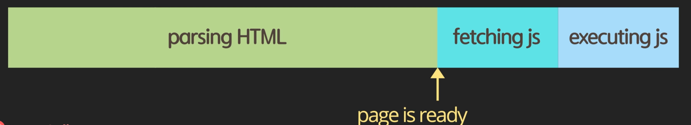

# JavaScript

> 드림코딩 by 엘리 JavaScript 기반 내용 정리

# Script async vs defer

## html에서 js script를 호출하는 보편적인 방법

### 1. head 내에 그냥 선언

```html
<!DOCTYPE html>
<html lang="en">
<head>
    <meta charset="UTF-8">
    <title>Title</title>
    <script src="main.js"></script>
</head>
<body></body>
</html>
```


- `script` 태그가 보이는 즉시 필요한 js 스크립트 파일은 fetch 한 후 실행함
- 단점
    - 파일의 크기가 클 경우 다운 받는 시간이 오래 소요됨
    - 즉, 사용자가 웹 사이트를 보는데 많은 시간이 걸림

### 2. body 끝에 선언
```html
<!DOCTYPE html>
<html lang="en">
<head>
    <meta charset="UTF-8">
    <title>Title</title>
</head>
<body>
<script src="main.js"></script>
</body>
</html>
```

- 내가 써왔던 방법...
- HTML 파싱 후 마지막에 js 다운 받음
- 장점
  - JS 다운 전, 기본적인 HTML 컨텐츠를 미리 확인할 수 있다.
- 단점
  - JS에 의존적인 기능들이 많은 경우 정상적인 페이지 확인이 어려움 (동적 기능, DOM 요소 들이 제대로 실행되지 않음)
  - 즉, JS fetching, excuting 과정을 다 기다려야 함

### Async
```html
<!DOCTYPE html>
<html lang="en">
<head>
    <meta charset="UTF-8">
    <title>Title</title>
    <script async src="main.js"></script>
</head>
<body>
</body>
</html>
```


- `async` 속성 값에 따라 병렬로 js가 fetch가 수행되며, fetch가 완료된 시점에 즉시 실행된다.
- 장점
  - 미리 js 파일을 다운 받고 실행하기 때문에, 다운로드 시간을 절약할 수 있음
- 단점
  - 전체 HTML가 parsing 전에 js가 미리 실행되어 위험하다. 
    - 아직 정의되지 않은 HTML 요소에 대한 DOM 조작 등이 이루어질 수 있기 때문
  - 중간 js 실행을 위해 페이지가 멈출 수 있다.
    - 즉, 사용자가 대기하는 시간이 여전히 오래 걸린다.

### defer
```html
<!DOCTYPE html>
<html lang="en">
<head>
    <meta charset="UTF-8">
    <title>Title</title>
    <script defer src="main.js"></script>
</head>
<body>
</body>
</html>
```


- `defer` 속성 값에 따라 병렬로 js fetch를 수행한다. 단, HTML parsing이 완료된 후에 js가 실행된다.
- 장점
  - 미리 js 파일을 다운 받기 때문에, 다운로드 시간을 절약할 수 있음
  - html parsing을 모두 완료한 후에 js가 즉시 실행되어, async 이슈가 모두 해결된다.
  
## async vs defer 
- 공통점 : 명령이 내려진 즉시 병렬적으로 fetch를 수행한다.
- 차이점
  - async : fetch가 완료된 시점을 기준으로 바로 js가 실행된다.
    - 즉, 명령 순서에 따라 실행 순서가 보장되지 않는다. 
  - defer : 명령 순서에 따라 실행 순서가 보장된다.
    - 다른 모듈을 참고하고 있어 순서 보장이 필요한 경우 유용함.
  
# use strict
- ECMAScript5에 추가된 모드
- Tip
  - VanilaJS 사용시 js 파일 앞 부분에 선언해주면 좋다.
  - TypeScript에서는 필요 없다.
- 사용 목적 : JavaScript가 가지고 있는 Flexible한 특징으로 인해 발생되는 비상식적인 이슈들을 감지하여 에러로 간주해준다.
  - 또한, JS 엔진이 효율적으로 분석할 수 있어 성능 개선까지 기대할 수 있다.