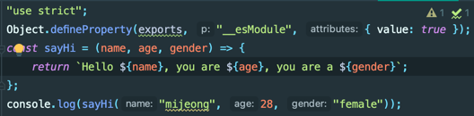

# TypeScript

## TypeScript란?
자바스크립트에 타입을 부여한 **정적 언어**입니다. (동적 언어) 자바스크립트의 확장된 언어로, 타입스크립트는 자바스크립트와 달리 브라우저에서 실행하려면 파일을 한번 변환해주어야 합니다. 이 변환 과정을 우리는 컴파일(complile) 이라고 부릅니다

### 장점
- **컴파일** 과정을 거치기 때문에 에러를 사전에 방지할 수 있습니다. 
- VScode 및 Webstorm은 타입스크립트 지원 기능이 내장되어 있기 때문에 별도의 설정 없이도 타입스크립트 파일을(.ts, tsconfig.json 등) 인식할 수 있고 코드 검사, 빠른 수정, 실행 및 디버깅 등의 다양한 기능을 바로 사용할 수 있습니다.

---

# 개인 의견
swift와 비슷한 철학을 가진 언어 같다.
Vue에 적용하기 적합한지 여러 글을 읽어보고 판단해봐야겠다.

---
# TypeScript 학습
> https://nomadcoders.co/typescript-for-beginners/lobby

## Setting TypeScript Up
### tsconfig.json
- TypeScript에게 어떻게 JavaScript 변환하는지 옵션 정의하는 용도
```json
{
  "compilerOptions": {
    "module": "commonjs", //node.js를 평범하게 사용 (import, export)
    "target": "ES2015", //어떤 버전의 JavaScript를 사용할 것인지 정의
    "sourceMap": true, // sourceMap 처리 여부
    "outDir": "dist" // 컴파일된 js 파일이 들어갈 위치
  },
  "include": ["day4/**/*.ts"], // 컴파일 과정에서 포함할 파일의 배열 정의
  "exclude": ["node_modules"] // 제외할 파일 정의
}
```
- Node.js는 TypeScript를 이해하지 못하기 때문에 일반적인 JavaScript로 컴파일 하는 작업이 필요하다.
```json
# package.json
{
  ...
  "scripts": {
    "prestart": "tsc --build tsconfig.json",
    "start": "node index.js",
  },
}
```
- 이제 아래 명령어를 사용해 컴파일할 경우 ts 파일을 변환한 js파일이 생성됨
```shell
tsc
```

## First steps with Typescript
- `export {}`를 선언하여 모듈이라고 정의 필요
### 특징
- 함수의 누락된 매개변수 안내

- 함수의 타입 안내

  
- 인터페이스 기능 제공
  - Object의 타입 정의 가능. 매개변수를 Object 형으로 받고자 할 때 유용
  - typescript에서만 작동하며 JS 컴파일 시 정의되지 않음 (더 안전)
  - 정의(TS)
    
  - 결과(JS)
    
- 클래스 기능 제공
  - 인터페이스와 유사하나, 컴파일 시 JS에 정의됨
  - react, express 등을 사용하며 JS에 반드시 정의가 필요할 때 위주로 쓰일 것
  - 정의 (TS)
    
  - 결과 (JS)
    

### 문법
- Optional 선언 : `{변수}?`
- Type 선언 : `{변수 or 함수}:{Type}`
- Interface: Object의 타입 정의 가능
```ts
interface Human {
    name:string,
    age:number,
    gender:string
}
```
- Class: Java와 유사
  - private / public : TS에서만 유효하며, `private`으로 선언된 변수는 외부에서 호출 불가
  - 생성자 정의 가능
```ts
class Human {
    public name:string;
    public age:number;
    public gender:string;
    constructor(name: string, age:number, gender:string) {
        this.name = name;
        this.age = age;
        this.gender = gender;
    }
}
```
---

# Reference
- https://heropy.blog/2020/01/27/typescript/
- https://joshua1988.github.io/ts/
