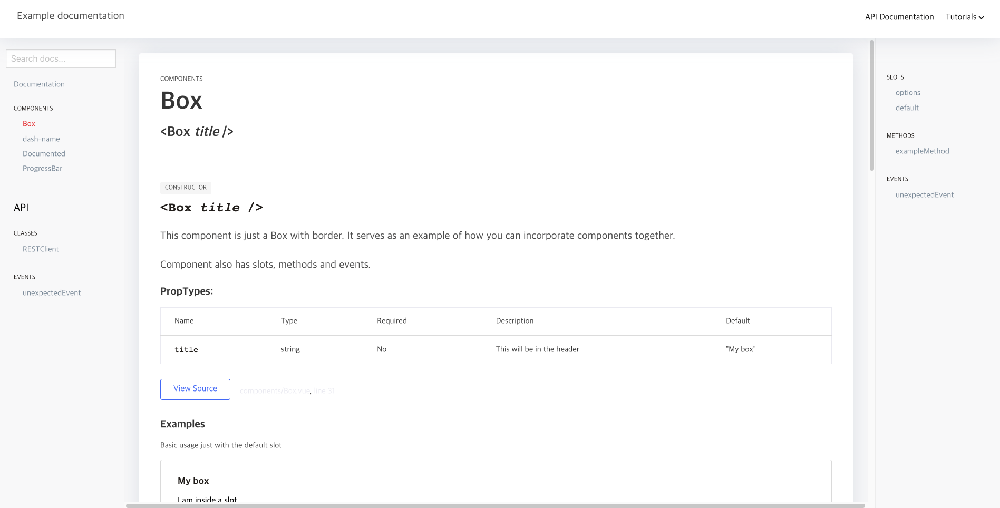

UI 컴포넌트 정의, 연결하여 웹 사이트를 쉽게 구축할 수 있음
https://blog.bitsrc.io/7-tools-for-faster-frontend-development-in-2022-43b6f663c607

## JS Document 지원 도구
템플릿 정의 후 주석 달면 자동으로 JS 파일을 문서화 해줌
- Vue 컴포넌트 들을 정의하면 좋을 듯

### Better-docs
- (vue 전용으로 예제 제공): https://github.com/SoftwareBrothers/better-docs
